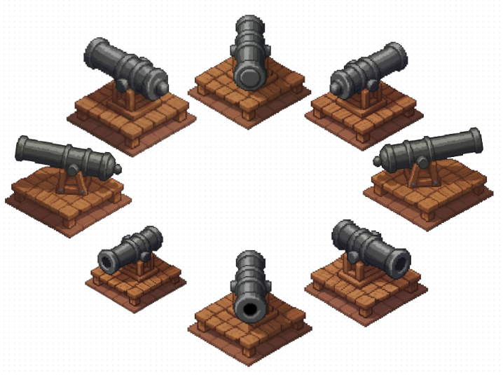
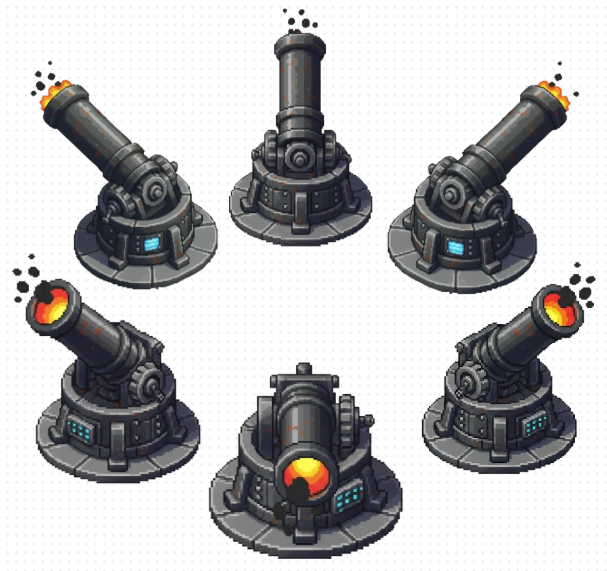

# General's Oath - Tower Defense

## 🚀 Son Güncellemeler (v1.3)

Bu sürümde kulelerin görsel geri bildirimleri, animasyon sistemleri ve proje dosya yapısı üzerine odaklanıldı.

### 🛡️ Kule Animasyon & Rotasyon Sistemi
Kuleler artık menzillerine giren düşmanları algılıyor ve gerçek zamanlı olarak hedefe yöneliyor.

* **Cannon (Top) Kulesi:** 8 yönlü (45 derecelik açılarla) tam rotasyon desteği. Düşman hareketine göre en yakın sprite'ı otomatik seçer.
* **Mortar (Havan) Kulesi:** 6 farklı sprite kullanarak 8 yönlü bakış açısını simüle eden özel yönlendirme algoritması.
* **Dinamik Ölçeklendirme (Scaling):** Her bakış açısı için sprite boyutları manuel olarak optimize edildi, böylece perspektif bozulmaları giderildi.
* **Gelişmiş Fizik Algılama:** `OnTrigger2D` ve `Rigidbody2D` optimizasyonları ile düşman takip sistemi daha kararlı hale getirildi.

---

## 📸 Geliştirme Görselleri

### Cannon Tower Takip Sistemi
Top kulesinin 8 farklı yöne pürüzsüz geçişi ve hedefleme mekanizması:

### Mortar Tower 6-Sprite Rotasyon Mantığı
Kısıtlı görselle 8 yönü nasıl simüle ettiğimizin teknik önizlemesi:

---

## 📂 Dosya Yapısı (Özet)
Proje düzeni profesyonel standartlara göre yeniden organize edildi:
* **Assets/Scripts:** Tüm kule ve mekanik kodları.
* **Assets/Sprites:** Kulelerin yön görselleri ve UI elementleri.
* **Videos:** Geliştirme sürecine dair tanıtım materyalleri.

---
*Bu proje geliştirilmeye devam etmektedir. Bir sonraki aşama: Mermi ve Alan Hasarı sistemleri.*