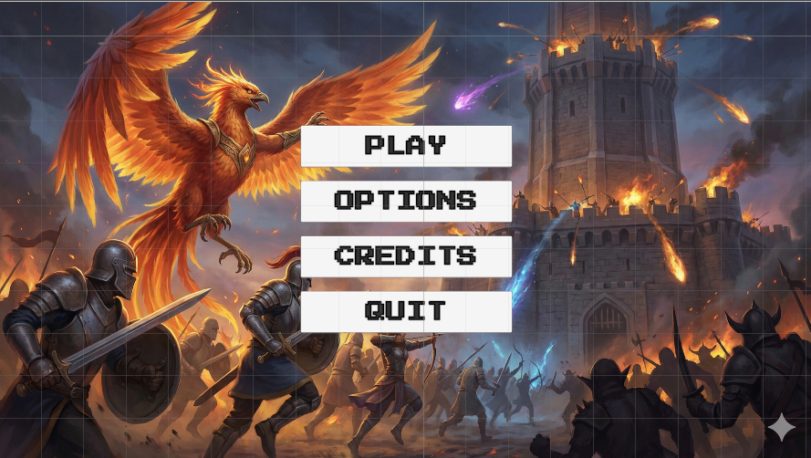

# General's Oath - Tower Defense Game

**İzometrik Tower Defense Oyunu** - Unity 6.2 ile Ubuntu 24.04 üzerinde geliştirilmiştir.



---

## 🎮 Oyun Özellikleri

### Ana Menü Sistemi
- **MainMenu Scene:** Oyun logosu, müzik ve butonlu ana menü
- **Play, Options, Credits, Quit** butonları
- **Ses kontrolü:** Ana menüde volume slider ile müzik seviyesi ayarlanabilir
- **Scene yönetimi:** Play butonuyla GameScene'e geçiş

### Oyun Sahnesi (GameScene)
- **İzometrik top-down görünüm** ile tower defense haritası
- **Dinamik kamera sistemi:**
  - Mouse scroll ile zoom (3-9 arası orthographic size)
  - WASD veya ok tuşları ile 4 yönlü hareket
  - Zoom seviyesine göre dinamik hareket sınırları
  - Maksimum zoom'da hareket tamamen kilitlenir
- **Tower sistemleri:** Cannon ve Mortar kuleleri (sprite tabanlı rotasyon)
- **UI Elementleri:** Heal, Barrier, Rage, Attack yetenekleri

### Pause Menüsü
- **Pause butonu:** Sağ üstte, tıklandığında alevli görsele döner
- **Pause paneli:**
  - Arkaplan blur/koyulaşma efekti
  - Home butonu (Ana menüye dönüş)
  - Resume butonu (Oyuna devam)
  - Volume slider (Handle içinde dinamik % göstergesi)
  - Mute butonu (4 seviyeli dinamik ses ikonu)
- **Pause aktifken:**
  - `Time.timeScale = 0` ile oyun durur
  - Kamera zoom ve hareketi devre dışı kalır
  - Slider ile ses ayarı yapılabilir

### Ses Sistemi
- **MusicManager:** DontDestroyOnLoad ile scene'ler arası müzik devamlılığı
- **Dinamik müzik:** MainMenu ve GameScene için farklı müzikler
- **4 Seviyeli ses göstergesi:**
  - 0%: Sessiz ikon (mute)
  - 1-33%: 1 dalga
  - 34-70%: 2 dalga
  - 71-100%: 3 dalga
- **Mute toggle:** Tek tıkla sessiz, tekrar tıkla önceki seviyeye dön
- **PlayerPrefs:** Ses ayarları kalıcı olarak kaydedilir

---

## 🎯 Kamera Sistemi (Detaylı)

### Zoom Mekanizması
- **Zoom aralığı:** 3 (yakın) - 9 (uzak)
- **Zoom hızı:** Inspector'dan ayarlanabilir (default: 25)
- **Orthographic projection:** 2D/izometrik oyunlar için optimize

### Dinamik Hareket Sınırları
Zoom seviyesine göre otomatik hesaplanan sınırlar:

| Projection Size | Hareket Alanı |
|----------------|---------------|
| 8-9 (Max zoom) | 0 (hareket yok) |
| 5 (Orta) | ~5.3 birim |
| 3 (Min zoom) | ~8.9 birim |

**Formül:**
```
delta = maxZoomSize - currentSize
maxX = delta * xFactor (1.78)
maxY = delta * yFactor (1.02)
```

### Pause Entegrasyonu
- Pause aktifken: `SetCameraControlsEnabled(false)`
- Resume'da: `SetCameraControlsEnabled(true)`
- Zoom değişiminde pozisyon otomatik clamp edilir (gökyüzü görünmez)


---

## 🎨 UI/UX Özellikleri

### Pause Menüsü UX
- **Blur overlay:** Arkaplan koyulaşma (alpha: 200)
- **Volume handle:** Görselin içinde dinamik sayı (0-100)
- **Renk kodlaması:**
  - Kırmızı: 0% (sessiz)
  - Sarı: 1-30%
  - Beyaz: 31-100%
- **Buton feedback:** Pause butonu aktifken alevli görsel

### Kamera UX
- Smooth zoom (Mathf.Clamp)
- Anında sınır kontrolü (teleport yok)
- Zoom'a göre otomatik hareket alanı ayarı
- Console log'ları ile gerçek zamanlı debug


---

## 🎮 Kontroller

| Komut | Aksiyon |
|-------|---------|
| **WASD / Ok Tuşları** | Kamera hareketi |
| **Mouse Scroll** | Zoom in/out |
| **ESC / Pause Butonu** | Pause menüsü |
| **M** | Mute toggle (pause'dayken) |


---

**Geliştirici:** Görkem  
**Platform:** Ubuntu 24.04 + Unity 6.2  
**Proje Tipi:** 2D İzometrik Tower Defense  
**Durum:** Aktif Geliştirme

---

*Son Güncelleme: v1.4 - Kamera zoom sistemi, pause menüsü ve müzik entegrasyonu*