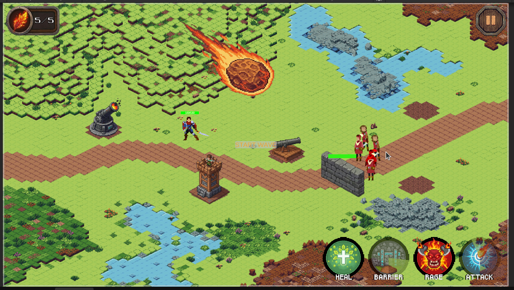

# General's Oath

**Isometric Tower Defense** - Unity ile geliştirilmiştir.



---

## 🎮 Temel Özellikler

### Oyun Mekanikleri
- **3 Harita:** Grifon, Kirin ve Ejderha bölgeleri.
- **Dinamik Wave Sistemi:** Farklı düşman tipleri ve Boss savaşları.
- **Gelişmiş Kule Sistemi:**
  - *Okçu & Havan:* 8 yönlü sprite rotasyon sistemi.
  - *Havan:* Parabolik atış ve Alan Hasarı (AOE).
- **Hero & Yetenek Sistemi:**
  - Click-to-move (Tıkla-Git) kontrolü.
  - 4 Aktif Yetenek: **Rage** (Hız/Hasar), **Heal** (İyileştirme), **Barrier** (Engel), **Meteor** (Alan Saldırısı).
- **İzometrik Derinlik:** `DepthSorter` ile Y eksenine bağlı dinamik sorting order (2.5D görünüm).

### Kontroller
| Komut | Aksiyon |
|-------|---------|
| **Sol Tık (Zemin)** | Hero hareketi |
| **Sol Tık (Buton/Yol)** | Kule inşası / Yetenek kullanımı (Bariyer/Meteor) |
| **Sağ Tık / ESC** | İnşaat veya Yetenek modunu iptal etme |
| **Q** | Özel Yetenek Kısayolu |
| **B** | Bloklama Modu |
| **Mouse Scroll** | Kamera Zoom |

---

## 🛠️ Son Geliştirme Güncellemeleri (Dev Update v2.0)

### 🛡️ Bariyer Sistemi (Barrier Ability)
Düşmanların ilerleyişini fiziksel olarak durduran stratejik engel mekaniği eklendi.
- **Path Snapping:** `PathSystem` scripti, mouse harita üzerinde gezinirken düşman yolunu (Waypoints) matematiksel olarak algılar.
- **Akıllı Yerleştirme:** Bariyer hayaleti (Ghost), her zaman yolun akış yönüne **dik (perpendicular)** olacak şekilde (otomatik rotasyonla) yerleşir.
- **Yıkılabilir Yapı:** Bariyerlerin kendi can değeri vardır. Canı tükenene kadar düşmanları tutar, yıkıldığında düşmanlar yola devam eder.
- **Düşman Etkileşimi:** `Enemy.cs` güncellendi; düşmanlar bariyeri algıladığında (`Tag: Barrier`) yürümeyi keser, "Attack" animasyonuna geçer ve bariyere hasar verir.

### ☄️ Meteor Saldırısı (Meteor Strike)
Yüksek hasarlı alan saldırısı (AOE) mekaniği eklendi.
- **Hedefleme Sistemi:** `AttackManager` ile mouse ucunda yarı saydam bir nişangah (Target Indicator) belirir.
- **Animasyon & Fizik:** Tıklanan noktaya ekranın dışından (sağ üst) belirli bir hızla kayarak gelen meteor animasyonu eklendi.
- **Hasar Mantığı:** Çarpışma anında `Physics2D.OverlapCircleAll` kullanılarak menzildeki tüm düşmanlara anlık hasar verilir.

### 🎮 Input Yönetimi & Çakışma Çözümleri
- **State-Based Input:** `HeroInput` scripti artık bir "Trafik Polisi" gibi çalışıyor.
- **Mode Checking:** Eğer `BarrierPlacementManager` veya `AttackManager` aktifse, Hero hareket komutlarını yok sayar. Bu sayede oyuncu yola bariyer koymaya çalışırken Hero'nun oraya koşması engellendi.
- **Coroutine Gecikmesi:** Mod kapatma işlemlerine frame gecikmesi eklenerek tıklama çakışmaları (Race Condition) giderildi.

### 🎨 Görsel İyileştirmeler
- **Dynamic Sorting:** `DepthSorter` scripti ile hareketli (Hero/Enemy) ve durağan (Tower/Barrier) objelerin derinlik sırası `transform.position.y` değerine göre her karede güncelleniyor.

---

## 🏗️ Mimari & Dosya Yapısı

### Yeni Eklenen Yöneticiler (`TowerDefense.Environment` & `Core`)
- **BarrierPlacementManager:** Bariyerin hayalet görüntüsünü, açı hesaplamasını ve yerleştirilmesini yönetir.
- **AttackManager:** Meteor hedeflemesini ve spawn işlemini yönetir.
- **PathSystem:** Waypoint noktaları arasındaki vektörleri hesaplayıp en yakın yol segmentini bulur.
- **AbilityManager:** Tüm yeteneklerin (Rage, Heal, Barrier, Meteor) cooldown, buton etkileşimi ve kullanım haklarını yönetir.

### Düşman Sistemi (`TowerDefense.Enemy`)
- **Enemy.cs (Güncel):** Bariyer algılama (`OnTriggerEnter2D`), durma, saldırma ve yok olduğunda tekrar yürüme mantığı (State Machine) eklendi. Namespace çakışmaları giderildi.

### Yetenek Objeleri (`TowerDefense.Abilities` & `Buildings`)
- **MeteorStrike.cs:** Meteorun hareketi, patlaması ve düşmanlara hasar vermesi.
- **Barrier.cs:** Bariyerin can yönetimi ve yıkılma (Die) fonksiyonları.
- **BarrierSpriteController.cs:** Bariyerin 8 farklı yöndeki sprite ve collider'ını yöneten script.

---

## 📁 Önemli Klasörler

```text
Assets/
├── TowerDefense/
│   ├── Scripts/
│   │   ├── Abilities/      # MeteorStrike.cs
│   │   ├── Buildings/      # Barrier.cs, BarrierSpriteController.cs
│   │   ├── Core/           # GameManager, AttackManager, DepthSorter
│   │   ├── Environment/    # BarrierPlacementManager, PathSystem, WallSpawner
│   │   ├── Enemy/          # Enemy.cs (AI Logic Update)
│   │   └── Hero/           # HeroInput.cs (Conflict Fixes)
│   └── Prefabs/
│       ├── Abilities/      # MeteorPrefab, TargetIndicator
│       └── Buildings/      # BarrierPrefab (Dynamic Collider)
└── Screenshots/            # gameplay.png