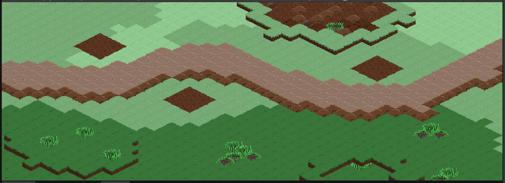

# 🎮 Unity 2D Isometric Project

Bu proje, arkadaşlarla birlikte geliştirilen bir izometrik oyun denemesidir. Her versiyon ve önemli değişiklik bu dosya üzerinden takip edilebilir.

---

## 🚀 Versiyon 1.0 - İlk Harita ve Temel Yapı
Bu aşamada projenin temel görsel ve teknik altyapısı oluşturulmuştur.

### ✅ Yapılan Çalışmalar:
* **2D Isometric Grid:** Sahne yapısı izometrik (isometric) düzene göre yapılandırıldı.
* **Tileset Seçimi:** Projenin görsel diline uygun tileset assetleri belirlendi ve projeye dahil edildi.
* **Tile Palette:** Hızlı harita tasarımı yapabilmek için Tile Palette hazırlandı ve fırçalar (brushes) ayarlandı.
* **Harita Tasarımı:** İlk deneme haritası oluşturularak grid sisteminin doğruluğu test edildi.

### 📸 Ekran Görüntüsü

> **Not:** Fotoğrafın görünmesi için `Screenshots` klasörüne `v1_harita.png` isminde bir görsel eklemeyi veya koda kendi dosya yolunu yazmayı unutma!

---

## 👥 Ekip ve Katkıda Bulunanlar
* [@SeninKullaniciAdin](https://github.com/SeninKullaniciAdin) - Proje Lideri / Level Design
* [ArkadaşınınAdı] - Developer

---
*Bu proje sürekli güncellenmektedir. Diğer versiyonlar için "Tags" kısmına bakabilirsiniz.*
