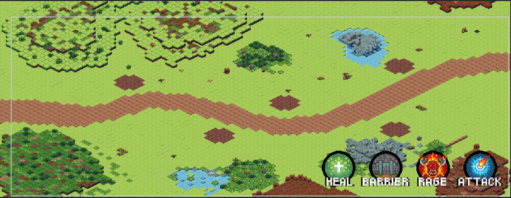

# 🎮 Unity 2D Isometric Project

---

## 🚀 Versiyon 1.1 - Görsel Yenileme ve İlk Mekanikler
Bu güncelleme ile projenin hem harita yapısı genişletildi hem de ilk etkileşimli butonlar sisteme dahil edildi.

### ✅ Yenilikler:
* **Tileset Güncellemesi:** Mevcut tileset daha detaylı bir setle değiştirildi, görsel kalite artırıldı.
* **Harita Genişletme:** Oyun alanı (Grid) boyutu büyütülerek daha geniş bir keşif alanı sunuldu.
* **Güçlendirme (Power-up) Butonları:** UI üzerine 4 adet aktif güçlendirme butonu eklendi.
* **C# Script Entegrasyonu:** Butonlar `OnClick` fonksiyonları ile çalışır hale getirildi. (Şu an için konsola log basmaktadır).

### 📸 Versiyon 1.1 Görünümü

---
*Bu proje sürekli güncellenmektedir. Diğer versiyonlar için "Tags" kısmına bakabilirsiniz.*
