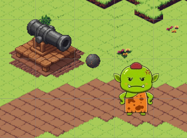

# General's Oath - v1.5 (Tower Defense Mechanics Update)

Bu sürüm ile birlikte oyunun temel savunma mekanikleri ve kule sistemleri tamamlanmıştır. Artık kuleler izometrik (oval) bir menzil içerisinde düşmanları algılayıp, her biri kendine has atış mekanikleriyle saldırı yapabilmektedir.

## 🏰 Eklenen Özellikler

### 1. Kule Sistemleri
* **Cannon Tower (Topçu Kulesi):**
    * Standart gülle atışı yapar.
    * Gülleler fiziksel obje olarak hedefe düz bir hatta ilerler.
* **Archer Tower (Okçu Kulesi):**
    * Düşmana kilitlenerek ok atar.
    * Oklar havada süzülürken uç kısımları (rotasyon) sürekli hedefe dönüktür.
* **Mortar Tower (Havan Kulesi):**
    * Parabolik (kavisli) atış mekaniği eklendi.
    * Mermiler hedefe varmadan önce havada yükselip alçalır (Arc hareketi).

### 2. Hedefleme ve Fizik
* **İzometrik Menzil:** Kuleler artık kusursuz bir daire yerine, izometrik kamera açısına uygun **Oval (Elips)** bir menzili tarar.
* **Akıllı Hedefleme:** Menzile giren düşmanlar listeye alınır ve kule her zaman en uygun hedefe saldırır.
* **Kinematic Fizik:** Düşmanlar ve kuleler arasındaki etkileşim, fizik motorunu yormayacak şekilde `Kinematic Rigidbody` ve `Trigger` sistemleri ile optimize edildi.

## 🛠️ Kurulum ve Test
1.  Projeyi Unity 2022/6 (veya sürümün neyse) ile açın.
2.  `SampleScene` sahnesini başlatın.
3.  `TestEnemy` prefabını kulelerin menziline sürükleyerek saldırı mekaniklerini test edebilirsiniz.

---
*Geliştirici Notu: Bir sonraki sürümde (v1.6) harita üzerine inşaat sistemi (Building Mechanic) ve UI entegrasyonu hedeflenmektedir.*